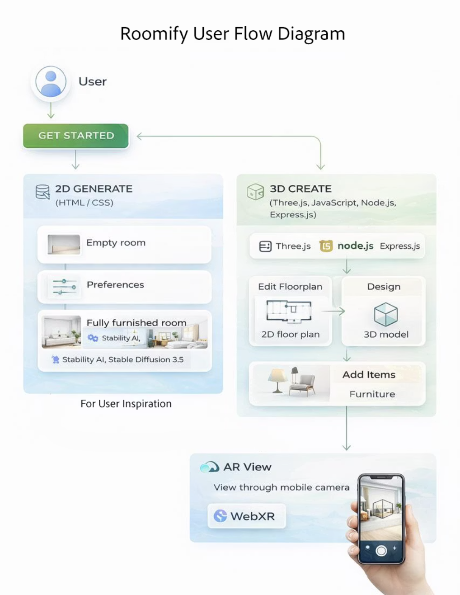

# ROOMIFY

> **From Empty Rooms to Beautiful Homes**

User-friendly interior designing in a 3D drag-and-drop workspace with Augmented Reality

---

## Problem Statement

Designing a house and arranging furniture is overwhelming for common people. There is a need for user-friendly interior design tools, similar to how Canva simplified graphic design.

**Existing solutions usually offer:**
- Either a simple UI, **or**
- A professional AR experience
- **Rarely both**

This is the gap **Roomify** addresses.

---

## System Architecture

<!-- Architecture Diagram Placeholder -->


---

## Feasibility & Scalability

- Convert the drag-and-drop interface into a **marketplace**
- Directly bridge users and furniture retailers
- Scale the platform so users can customize 3D models by uploading images of furniture

---

## Technology Stack

| Category | Technologies |
|----------|-------------|
| **Frontend** | React, Three.js |
| **Backend** | Node.js, Python, Express.js, REST APIs |
| **AI & ML** | Image-to-Image generation, Recommendation generation, Google Gemini |
| **3D & AR** | WebXR, Three.js, Blender |

---

## Project Structure

```
Roomify/
├── 3d_room/                 # 3D Room Designer & AR View
│   ├── example/             # Main 3D room designer interface
│   ├── ar_view/             # AR viewing server and mobile interface
│   ├── src/                 # TypeScript source files
│   └── lib/                 # Type definitions
├── pscmr/                   # Python Backend (AI Services)
│   ├── app.py               # Flask application
│   ├── templates/           # HTML templates
│   └── static/              # Static assets
└── frontend/                # Landing page
```

---

## Implementation Guide

### Prerequisites

- **Node.js** (v14 or higher)
- **Python** (v3.8 or higher)
- **npm** or **yarn**
- **pip**

### 1. Clone the Repository

```bash
git clone https://github.com/yourusername/Roomify.git
cd Roomify
```

### 2. Setting Up the 3D Room Designer

```bash
# Navigate to 3d_room directory
cd 3d_room

# Install dependencies
npm install

# Build the project
grunt

# Open the example in your browser
open example/index.html
# Or simply open 3d_room/example/index.html in your browser
```

### 3. Setting Up the AR Server

```bash
# Navigate to ar_view directory
cd 3d_room/ar_view

# Install dependencies
npm install

# Generate SSL certificates for HTTPS (required for AR on mobile)
npm run generate-certs

# Start the AR server
npm start
# Or for development with auto-reload:
npm run dev
```

The AR server will be available at `https://localhost:3000`

### 4. Setting Up the Python Backend (AI Services)

```bash
# Navigate to pscmr directory
cd pscmr

# Create a virtual environment (recommended)
python -m venv venv
source venv/bin/activate  # On Windows: venv\Scripts\activate

# Install dependencies
pip install -r requirements.txt

# Create a .env file with your API keys
cat > .env << EOF
GEMINI_API_KEY=your_gemini_api_key
HF_API_TOKEN=your_huggingface_token
STABILITY_API_KEY=your_stability_api_key
EOF

# Run the Flask application
python app.py
```

The Python backend will be available at `http://localhost:5000`

---

## How to Use

### 3D Room Designer

1. **Open the Application**: Launch `3d_room/example/index.html` in a modern browser
2. **Design Your Floor Plan**: 
   - Use the 2D view to draw room walls
   - Click and drag to create walls
   - Double-click to complete a room
3. **Add Furniture**:
   - Switch to 3D view
   - Browse the furniture catalog on the right panel
   - Drag and drop items into your room
4. **Customize**:
   - Click on items to select them
   - Resize, rotate, or delete items
   - Adjust wall textures and colors
5. **Export for AR**:
   - Save your design
   - Export to view in Augmented Reality

### AR View (Mobile)

1. **Start the AR Server**: Ensure the AR server is running
2. **Access on Mobile**: 
   - Connect your mobile device to the same network
   - Navigate to `https://your-ip:3000/ar-mobile.html`
3. **View Your Design**:
   - Point your camera at a flat surface
   - Your room design will appear in AR
   - Walk around to explore from different angles

### AI-Powered Features

1. **Room Analysis**: Upload an image of an empty room
2. **AI Recommendations**: Get furniture suggestions based on room style
3. **Image Generation**: Generate furnished room visualizations

---

## Configuration

### Environment Variables (pscmr/.env)

| Variable | Description |
|----------|-------------|
| `GEMINI_API_KEY` | Google Gemini API key for room analysis |
| `HF_API_TOKEN` | HuggingFace API token for AI models |
| `STABILITY_API_KEY` | Stability AI key for image generation |

---

## Contributing

1. Fork the repository
2. Create a feature branch (`git checkout -b feature/AmazingFeature`)
3. Commit your changes (`git commit -m 'Add some AmazingFeature'`)
4. Push to the branch (`git push origin feature/AmazingFeature`)
5. Open a Pull Request

**Thank You!**

We hope Roomify makes you more connected with your home.